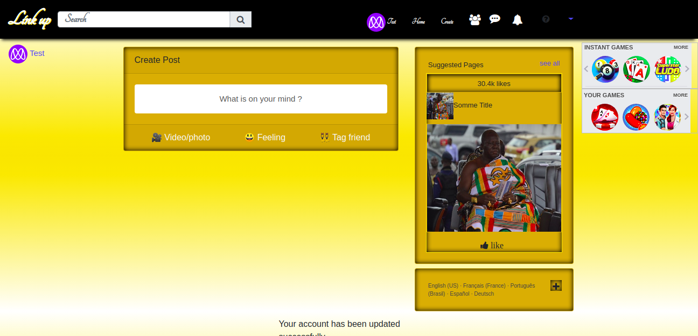

# lINK-UP social network

A practical implementation of rails for development of an app similar to [Facebook](facebook.com) as part of a series of projects to be completed by students of [Microverse](https://www.microverse.org/ "The Global School for Remote Software Developers!").




## Descritpion

This a application has the functionalities of a social media appliaction. Authorized user are able to perform the ```[Features]``` stated in the section below. The features of this application tend to mimic most basic features of the facebook social media appliaction.

## Technologies

- HTML
- CSS
- Ruby
- Ruby on Rails 
- SASS
- facebook Omniauth

## Features

- Sign up
- Login 
- Upload post
- Like a post
- Comment on a post
- View notification
- Send friend request
- Accept friend request
- View post frm friends
- View mutual friends

## Usage

> Clone the repository to your local machine

```sh
$ git clone https://github.com/forison/social-network.git
```
> cd into the directory

```sh
$ cd social-network
```

> open by issuing the command ```rails s```

## Testing

> Clone the repository to your local machine

```sh
$ git clone https://github.com/forison/social-network.git
```
> cd into the directory

```sh
$ cd social-network
```

> run ```rspec```

## Deployment

The demo page can be found [HERE](https://nosebook.herokuapp.com)

## Designed and developed by

[Boakye Addo Forison](https://github.com/Forison)

## Contact

[LinkedIn](https://www.linkedin.com/in/forison/) | [Twitter](https://twitter.com/addo_forison)

## Appreciation

[Microverse](https://www.microverse.org/ "The Global School for Remote Software Developers!")

## Contributing

1. Fork it (https://github.com/Forison/social-network/)
2. Create your feature branch (git checkout -b feature/[choose-a-name])
3. Commit your changes (git commit -am 'What this commit will fix/add')
4. Push to the branch (git push origin feature/[chosen name])
5. Create a new Pull Request

## License

This project is licensed under the MIT License - see the [LICENSE](./LICENSE.md) file for details
